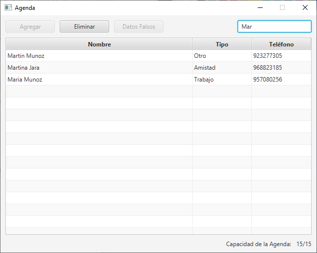

# Agenda

### Descripción del Problema
Un participante de talentos digitales, ha extraviado su teléfono celular, para solucionar dicho conflicto decide realizar una agenda telefónica de contactos, ya que afortunadamente había respaldado su agenda en su cuenta de correo.
1. Un Contacto está definido por un Nombre y un Teléfono (No es necesario validar)
2. Un Contacto es igual a otro cuando sus nombres son iguales
3. Una Agenda de contactos está formada por un conjunto de contactos. Piensa en qué tipo puede ser: Amigos, Trabajo, etc.
4. Se podrá crear de dos formas: El usuario puede escoger la capacidad de la agenda o con un tamaño 15 por defecto.

### Requisitos
Producto final no probado en versiones previas a:
- Java JDK 13.0.2
- JavaFX 13.0.2

### Pendientes
- [ ] Contactos editables
- [ ] Listado permanente
- [ ] Considerar agregar más detalles a los Contactos (comentarios, dirección, etc.)

### Capturas de Pantalla
* Pantalla de "Bienvenida", donde el usuario tiene que ingresar la capacidad límite de la Agenda. En caso de no ingresar un número o ingresar 0 (cero), la aplicación asume que por defecto se utilizará un tamaño de 15

* Pantalla principal: Botón Eliminar desactivado por defecto.

* Agenda Llena: Botón "Agregar" y "Datos Falsos" desactivados para prevenir que el usuario siga agregando datos a la Agenda

* Agregar Contacto: Si el usuario no ingresa el nombre o el número, arrojará un error indicando que son campos obligatorios

* Eliminar Contacto: Se le presenta un dialogo de confirmación para prevenir la eliminación de datos por accidente

* Filtrar Contactos: Filtra el listado de Contactos desde la primera letra que ingresa el usuario

